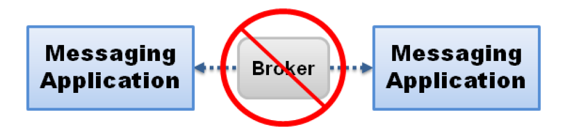
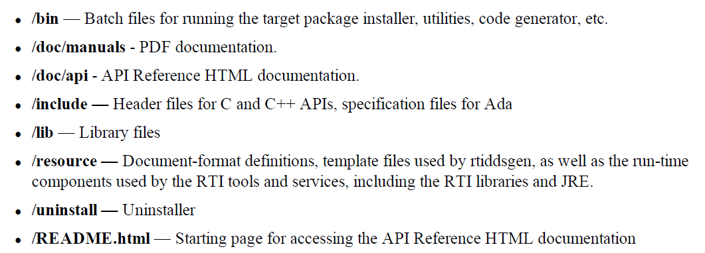

# SiemensDemo

## DDS Introduction
Peer-to-peer, publish-subscribe communications—The most elegant, flexible data communications
model.

- Simplified distributed application programming
- Time-critical data flow with minimal latency
- Clear semantics for managing multiple sources of the same data.
- Customizable Quality of Service and error notification.
- Guaranteed periodic messages, with minimum and maximum rates set by subscriptions
- Notifications when applications fail to meet their deadlines.
- Synchronous or asynchronous message delivery to give applications control over the degree of concurrency.
- Ability to send the same message to multiple subscribers efficiently, including support for reliable multicast with customizable levels of positive and negative message acknowledgement.



## DDS Features

- Configurable QoS
- No Broker
- Automatic failover
- Configurable retries
- Redundant publishers, subscribers, networks, and more
- Publishers and subscribers can start in any order, and enter or leave the network at any time

## Experiment Environment
- Raspberry Pi 3
    - Architecture: armv7l
    - Kernel: Linux 4.17
    - GCC Version: 4.7.3
- Linux Machine with Ubuntu 18.04
- [RTI DDS Connext 6 Host Bundle](https://s3.amazonaws.com/RTI/Bundles/6.0.0/Evaluation/rti_connext_dds_secure-6.0.0-eval-x64Linux4gcc7.3.0.tar.gz)
- [RTI DDS Connext 6 Target Bundle](https://community.rti.com/static/downloads/connext-dds/6.0.0/rti_connext_dds-6.0.0-core-target-armv6vfphLinux3.xgcc4.7.2.rtipkg)

## Steps of Running an Experiment

```sh
# In host machine
cd SiemensDemo/Manager
./run.sh <experiment ID>

# ssh into Siemens Experiment Master Pi
ssh siemens

cd ~/DDSExp

# see supported commands using -h
./cmder.py -h

# example: start subscriber on s1,s2,s3; and publisher on s4
./cmder.py -l "s1,s2,s3" -u -c "/home/pi/DDSExp/SiemensDemo_subscriber"
./cmder.py -l "s4" -u -c "/home/pi/DDSExp/SiemensDemo_publisher"

# You can follow CMDExec.log to check log details
tail -f CMDExec.log
```

## Setup Experiment on Raspberry Pi 3(C++)

**Notes: Steps 1~15 are all conducted on the 64-bit Linux machine with ubuntu 18.04**

1. Download Connext DDS: https://www.rti.com/free-trial/dds-files#6.0.0

    - Two Bundles:
        - Host Bundle: contains non-target-specific files, such as documentation, header files, tools, and infrastructure services executables.

            ```sh
            rti_connext_dds-<version>-<package_type>-host-<host-platform>.run
            ```

        - Target Bundle:  contains libraries and any applications that have target-specific dependencies.

            ```sh
            rti_connext_dds-<version>-<package_type>-target-<target_architecture>.rtipkg
            ```

2. Install host bundle:
  
    ```sh
    rti_connext_dds-6.0.0-<package_type>-host-<host_platform>.run --mode unattended --prefix <installation path>
    ```

3. Install target bundle:

    ```sh
    cd rti_connext_dds-6.0.0/bin
    rtipkginstall /home/<your user name>/Downloads/rti_connext_dds-6.0.0-pro-target-i86Linux3gcc4.8.2.rtipkg
    ```

4. Define environment variable:

    ```sh
    export NDDSHOME="/home/<your user name>/rti_connext_dds-6.0.0"
    ```

5. Update RTI workspace(optional)

    Edit <NDDSHOME>/resource/scripts/rticommon_config.sh

6. Install license file

    Place the installed license file in: <NDDSHOME> or rti_workspace/\<version\>

7. Learn the DDS directory tree

    

8. Examples: rti_workspace/6.0.0/example/

9. Add Connext DDS's bin directory to your path, so that you can run some simple commands without typing full path to the executable.

    ```sh
    nano ~/.profile
    # add the following line:
    export PATH="$PATH:$NDDSHOME/bin"
    ```
10. Define interface definition file(optional): \<project\>.idl

11. Set up linux Cross-compiling Environment for Raspberry Pi
    ```sh
    mkdir $HOME/toolchains
    cd $HOME/toolchains

    # On 64-bits linux machine
    wget https://s3.amazonaws.com/RTI/Community/ports/toolchains/raspbian-toolchain-gcc-4.7.2-linux64.tar.gz
    
    tar xvzf raspbian-toolchain-gcc-4.7.2-linux64.tar.gz
    ```
12. Prepare dynamic libraries:

    ```sh
    export LD_LIBRARY_PATH="${NDDSHOME}/lib/<architecture>"
    ```

13. Generate Code:

    ```sh
    rtiddsgen -ppDisable -language C++ -example <architecture> -replace <project>.idl
    ```

14. Make sure environment variables are effective:

    ```sh
    source ~/.profile
    ```

15. Make and build the project:

    ```sh
    make -f make/makefile_<project>_<architecture>
    ```

16. Copy the following executables to Raspberry Pis
    ```sh
    objs/<archiecture>/<project_name>_subscriber
    objs/<archiecture>/<project_name>_publisher
    ```
    
17. Start the subscriber:

    ```sh
    ./<project_name>_subscriber
    ```

18. Start the publisher:
    ```sh
    ./<project_name>_publisher
    ```