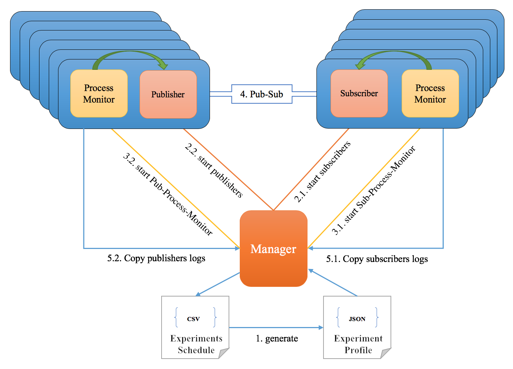
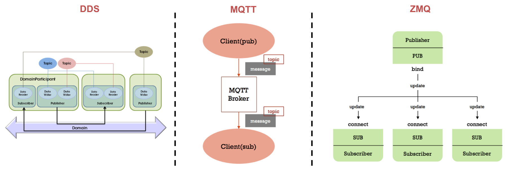

# iot-bench

The purpose of this project is analyzing performance of various common used middlewares in industry and academic area under different IoT traffic conditions.

## Benchmarking Framework

Execution Steps:

1. Manger generates experiment profile based on given experiment schedule;
2. Manager launches Pub/Sub application remotely;
3. Manager starts process monitor to track resource utilization of running pub/sub process;
4. Pub/sub application starts working, and Manager periodically check experiment status;
5. When all publishers and subscribers are done, Manager copies test log from remote host,  reorganize working directory, and process experiment results.

## Experiments

- [Throughput Test](https://github.com/scope-lab-vu/iot-bench/tree/master/ExperimentData(organized)/ThroughputTest)
- [Latency Test](https://github.com/scope-lab-vu/iot-bench/tree/master/ExperimentData(organized)/LatencyTest)
- [RTI-DDS QoS Test](https://github.com/scope-lab-vu/iot-bench/tree/master/ExperimentData(organized)/QoSTest)
- [Bursty Sporadic Stream Interference Test](https://github.com/scope-lab-vu/iot-bench/tree/master/ExperimentData(organized)/SporadicTest)
- [Serialization Test](https://github.com/scope-lab-vu/iot-bench/tree/master/ExperimentData(organized)/SerializationTest)
- [Platform Test](https://github.com/scope-lab-vu/iot-bench/tree/master/ExperimentData(organized)/RPi%26BBB)

## Experiment Environment

| Cluster | ARM | AMD |
| ------- | --- | --- |
| Scale | 10 | 10 |
| Node | Raspberry Pi 3 Model B |  AMD64 VM |
| Architecture | Armv7l | AMD64 |
| CPU | 1.2GHz, 4 Cores(only 1 was used in all tests) |  2.1GHz, 12 Cores(only 1 was used in all tests) |
| Memory | 1GB | 32GB |
| OS | Raspbian 9, Linux 4.14.91 | Ubuntu 16.04 |
| GCC | Raspbian 4.7.3-11+rpi1 | Ubuntu1 16.04.11 |
| Network Topology | Star | Star |
| Bandwidth | 100Mbps | 1Gbps |

## Middlewares & Testing Tools

| Middleware | Version | Test Tool |
| ---------- | ------- | --------- |
| RTI-DDS | RTI DDS Connext v6.0 | RTIPerftest v3.0 |
| MQTT | Eclipse Mosquitto v3.1 & Paho MQTT C v3.1 | Custom Software |
| ZeroMQ | ZeroMQ v4.2 | Custom Software |

## Performance Measurements

* Throughput
* RT Latency
* Process Monitor
    * CPU
    * Memory
    * TX, RX, TX Drop, RX Drop

## Run Experiments

**RTI-DDS**: User should initialize the value of each filed in the DDS/rtiperftest/profile.json file, as shown below. Then execute the DDS/rtiperftest/main.py file to start the experiment. All operations are performed on the manager node, but users should generate their own rtiperftest executable file since this depedends on the specific system configurations. Steps of creating perftest_cpp file is available [here](https://github.com/rticommunity/rtiperftest/blob/master/srcDoc/compilation.rst). The tutorial of doing cross-platform compilation could be found [here](https://community.rti.com/content/forum-topic/howto-run-rti-connext-dds-raspberry-pi). This is usually used for running RTI-DDS application on resource-constraint devices, such as Raspberry Pi or BeagleBone Blacks boards. Users can compile the perftest_cpp file on their localhost, then copy the compiled executable to the working environment. The executable file should be available in each worker node before runing experiments because we used SSH to perform remote process call and the master node is the only entrance of experiments. In order to ease operating process, we suggest adding SSH related information of publishers and subcribers into the /etc/ssh/ssh_config file, then restart the SSH service.